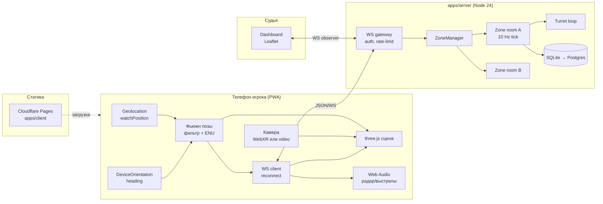
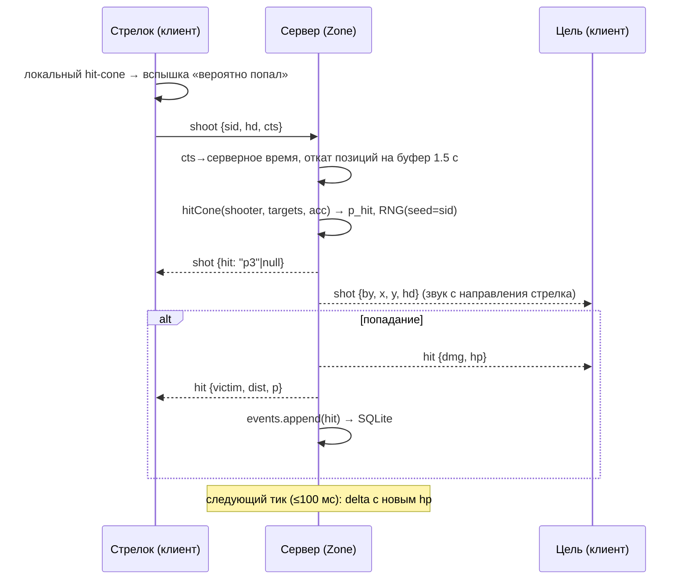

# MobilWar — архитектура

> Location-based AR-шутер для небольших групп на ограниченной уличной площадке. Веб-приложение (PWA), глобальный бэкенд. Документ фиксирует состояние технологий на сентябрь 2026 г., целевую архитектуру, протокол, ключевые алгоритмы, ADR и дорожную карту.

---

## 1. Проверенные факты о платформе (сентябрь 2026)

Ниже — факты, на которых построены решения. Помечено ⚠, если факт **противоречит** исходным допущениям проекта.

| Тема | Состояние | Источник |
|---|---|---|
| WebXR `immersive-ar` на iPhone | **Не поддерживается** в Safari на iOS 18/26. WebXR у Apple есть только в visionOS (и там AR-модуль не включён). Обход — только «AR-lite» (камера + датчики) или коммерческие SDK (8th Wall). | [XRDoctors](https://xrdoctors.pro/blog/webxr-on-ios-what-actually-works), [Apple Dev Forums](https://developer.apple.com/forums/thread/743655), [Variant Launch](https://launch.variant3d.com/blog/23-06-state-webxr-on-ios-beyond) |
| WebXR `immersive-ar` на Android | Работает в Chrome/Edge на ARCore-совместимых устройствах с установленным Google Play Services for AR (Chrome сам предлагает установку). | [ARCore WebXR requirements](https://developers.google.com/ar/develop/webxr/requirements), [ARCore devices](https://developers.google.com/ar/devices) |
| three.js | Последний релиз **r186** (8 сентября 2026). WebXR через `renderer.xr`, кнопка `ARButton` из `three/addons/webxr/ARButton.js`. | [Releases](https://github.com/mrdoob/three.js/releases), [ARButton docs](https://threejs.org/docs/pages/ARButton.html) |
| Geolocation API | `watchPosition({enableHighAccuracy:true})` даёт GPS-точность ≈5–15 м на открытом воздухе; первые 2–6 колбэков грубые, затем точность растёт. На iOS пользователь может отключить «Precise Location» — тогда координаты приблизительные. Только HTTPS. | [andygup.net](https://www.andygup.net/how-accurate-is-html5-geolocation-really-part-2-mobile-web/), [Gadget Hacks (iOS precise location)](https://ios.gadgethacks.com/how-to/stop-websites-from-asking-use-your-location-every-single-time-for-uninterrupted-browsing-safari-0384231/) |
| Компас / DeviceOrientation | iOS: `DeviceOrientationEvent.requestPermission()` только из жеста пользователя (iOS 13+), затем `deviceorientation` и `event.webkitCompassHeading`. Android Chrome: событие `deviceorientationabsolute` (с Chrome 50), в Safari его нет; фича не Baseline. | [w3c/deviceorientation#137](https://github.com/w3c/deviceorientation/issues/137), [Chrome blog](https://developer.chrome.com/blog/device-orientation-changes), [MDN](https://developer.mozilla.org/en-US/docs/Web/API/Window/deviceorientationabsolute_event) |
| WebSocket vs WebTransport | ⚠ **WebTransport стал Baseline**: Safari 26.4 (март 2026) включил его без флагов, т.е. доступен и на iOS. WebSocket по-прежнему повсеместен и проще в хостинге (WebTransport требует HTTP/3/QUIC на сервере и сертификаты). | [WebKit 26.4](https://webkit.org/blog/17862/webkit-features-for-safari-26-4/), [webrtc.ventures](https://webrtc.ventures/2026/04/webtransport-is-now-baseline-what-it-means-for-real-time-media/) |
| Colyseus | Активно развивается: 0.17 (февраль 2026: авто-реконнект, `defineServer()`, `maxMessagesPerSecond`), актуальная линия **0.18.x** (сентябрь 2026). Транспорты: `ws`, uWebSockets, Bun, h3. | [Colyseus 0.17 blog](https://colyseus.io/blog/colyseus-017-is-here/), [Releases](https://github.com/colyseus/colyseus/releases), [ws-transport](https://docs.colyseus.io/server/transport/ws) |
| Vibration API | iOS Safari `navigator.vibrate` **не реализован**. Хак с `<input type="checkbox" switch>` (haptic при переключении, Safari 17.4+) закрыт Apple в iOS 26.5. Работает на Android Chrome/Samsung Internet. | [testmuai](https://www.testmuai.com/learning-hub/vibration-api-browser-support/), [haptics lib](https://haptics.kushagragolash.dev/), [ios-haptics](https://github.com/tijnjh/ios-haptics) |
| Screen Wake Lock | Везде, включая iOS 16.4+; в установленных PWA на iOS баг исправлен в iOS 18.4. | [web.dev](https://web.dev/blog/screen-wake-lock-supported-in-all-browsers), [caniuse](https://caniuse.com/wake-lock) |
| Web Audio `PannerNode` | `panningModel: 'HRTF'` есть во всех браузерах; на iOS `AudioContext` стартует только после жеста пользователя; были баги пространственного эффекта у WebRTC-потоков в Safari (нас не касается — мы играем буферы). | [MDN PannerNode](https://developer.mozilla.org/en-US/docs/Web/API/PannerNode/panningModel), [Apple forums](https://developer.apple.com/forums/thread/696034) |
| PWA на iOS | Установка только вручную через «Поделиться → На экран „Домой“» (нет beforeinstallprompt). Нужны HTTPS, manifest (`display: standalone`), service worker, `apple-touch-icon`. В iOS 26 сайт с Home Screen по умолчанию открывается как web app. Решение Apple убрать Home Screen web apps в ЕС было отменено ещё в iOS 17.4. | [MDN installable](https://developer.mozilla.org/en-US/docs/Web/Progressive_web_apps/Guides/Making_PWAs_installable), [MobiLoud 2026](https://www.mobiloud.com/blog/progressive-web-apps-ios/), [TechCrunch](https://techcrunch.com/2024/03/01/apple-reverses-decision-about-blocking-web-apps-on-iphones-in-the-eu/) |
| ARCore Geospatial API | Только нативно: Android/iOS через ARCore SDK и Unity AR Foundation; «other platforms not available». Web-варианта нет. | [Geospatial](https://developers.google.com/ar/develop/geospatial), [Geospatial Creator](https://developers.google.com/ar/geospatialcreator/unity/quickstart) |
| Niantic Spatial (Lightship) VPS | Есть VPS for Web (через 8th Wall/Niantic Studio). Тариф: первые ~10 000 VPS-вызовов в месяц бесплатно, далее ≈$0.01/вызов; on-device CV-фичи ≈$0.10/MAU; Studio Pro ≈$700/мес. Точные цифры — по запросу у Niantic. | [Niantic pricing](https://www.nianticspatial.com/en/pricing), [Studio pricing](https://www.nianticspatial.com/augment/studio-pricing), [VPS for Web](https://nianticlabs.com/news/lightship-vps-web) |
| Node.js | ⚠ **Node 24 — Active LTS** (до апреля 2028), Node 22 — Maintenance LTS (EOL 30 апреля 2027), Node 26 — Current (LTS с октября 2026). Стартовать на 22 сегодня — значит переезжать через год. | [nodejs.org releases](https://nodejs.org/en/about/previous-releases), [v22→v24 migration](https://nodejs.org/en/blog/migrations/v22-to-v24) |
| SQLite в Node | `node:sqlite` встроен с 22.5 (RC-стабильность), полностью стабилизирован в Node 26. `better-sqlite3` быстрее и с богатым API, но требует нативной сборки. | [better-sqlite3#1245](https://github.com/WiseLibs/better-sqlite3/discussions/1245), [sqg benchmark](https://sqg.dev/blog/sqlite-driver-benchmark/) |
| Vite / pnpm | Vite **8.3** (Rolldown-бандлер, сентябрь 2026). pnpm **12.4** (переписан на Rust, август 2026); `pnpm-workspace.yaml` + catalogs — стандарт монорепо. | [Vite 8](https://vite.dev/blog/announcing-vite8), [vite releases](https://github.com/vitejs/vite/releases), [pnpm releases](https://github.com/pnpm/pnpm/releases) |
| Хостинг WS-сервера | ⚠ **Fly.io и Railway бесплатных тарифов больше не имеют** (Fly — триал 7 дней/2 VM-часа, потом ≈$2–5/мес; Railway — Hobby $5/мес с кредитами). **Render** сохраняет Free: 512 MB, 750 инстанс-часов/мес, спин-даун через 15 мин простоя, WebSocket поддерживается. | [Render article](https://render.com/articles/platforms-with-a-real-free-tier-for-developers-in-2026), [pricing compare](https://dev.to/pavel-hostim/render-vs-railway-vs-flyio-pricing-compared-2026-2e5p), [Fly free tier](https://www.saaspricepulse.com/blog/flyio-free-tier-2026) |
| Статика | Cloudflare Pages Free: безлимитный трафик, 500 сборок/мес. Netlify Free: 100 GB/мес, 300 кредитов/мес. | [CF Pages 2026](https://dev.to/nayankyada/cloudflare-pages-pricing-2026-free-tier-limits-workers-costs-when-to-upgrade-2ono), [CF vs Netlify](https://gautamkhorana.com/blog/cloudflare-pages-vs-netlify-2026/) |

**Главный вывод:** на iPhone «настоящего» WebXR-AR нет и не будет в обозримом будущем, поэтому AR-lite — не запасной, а **основной** путь для половины игроков; всё остальное (GPS, компас, звук, wake lock) на iOS работает.

---

## 2. Обзор системы



Монорепозиторий pnpm workspaces:

```
MobilWar/
├─ apps/
│  ├─ client/      Vite 8 + TS + three.js r186, PWA (vite-plugin-pwa), режимы: webxr | ar-lite | screenless | referee
│  └─ server/      Node 24 + ws, авторитетное состояние, комнаты = гео-зоны, tick 10 Hz
├─ packages/
│  └─ shared/      типы протокола (zod-схемы), гео-математика, модель ошибки GPS, anti-cheat plausibility
├─ pnpm-workspace.yaml (catalog: three, ws, zod, vitest, typescript)
├─ tsconfig.base.json, .github/workflows/ci.yml
```

`packages/shared` — единственное место, где живёт математика и типы; клиент и сервер импортируют одно и то же, поэтому «hit-cone» на клиенте (для предсказания) и на сервере (для вердикта) — одна функция.

### 2.1 Содержимое `packages/shared`

| Модуль | Экспорт | Назначение |
|---|---|---|
| `protocol.ts` | zod-схемы всех сообщений, `ClientMsg`/`ServerMsg` union-типы, `PROTOCOL_VERSION` | Единый источник правды для клиента и сервера; типы выводятся из схем (`z.infer`). |
| `geo.ts` | `haversine`, `toENU(origin, lat, lon)`, `fromENU`, `bearing`, `wrapDeg`, `angleDiff` | Вся геометрия; чистые функции без зависимостей. |
| `hit.ts` | `hitCone(shooter, targets, rules) → {target, p, theta, half}` | Вероятностный конус (§6.1); RNG детерминированный (`mulberry32(sid)`), чтобы клиент и сервер получали одно решение при одинаковых входах. |
| `gpsError.ts` | `sigmaFor(acc, speed, age)`, `plausibleJump(prev, next, dt)` | Модель ошибки: `σ = acc·0.5` (accuracy в браузерах — радиус 95%, а нам нужна 1σ), + `0.3·speed·age` за устаревание позиции. |
| `filter.ts` | `PosFilter` (альфа-бета по 2D), `HeadingFilter` (EMA по вектору) | Один и тот же фильтр используется клиентом для себя и сервером для сглаживания входящих `pos`. |
| `plausibility.ts` | `checkPos`, `checkShoot`, `RateLimiter` | Анти-чит (§6.3). |
| `zone.ts` | `pointInPolygon`, `Zone`/`Rules` типы, `DEFAULT_RULES` | Полигон зоны, правила матча (fireRate, dmg, range, respawn). |

Пакет собирается как ESM (`tsc -b`), без бандла; клиент импортирует его напрямую через workspace-ссылку `"@mobilwar/shared": "workspace:*"`.

---

## 3. Система координат

Зона (комната) создаётся с **origin** `(lat0, lon0)` — точкой на площадке. Все позиции внутри зоны выражаются в локальной касательной плоскости **ENU** (East-North-Up) в метрах: `x` — восток, `y` — север, `z` — вверх. Для площадок до ~1 км эквиректангулярное приближение точнее сантиметра:

```
R = 6378137
dLat = (lat - lat0)·π/180,  dLon = (lon - lon0)·π/180
y = R·dLat
x = R·dLon·cos(lat0·π/180)
```

Обратное преобразование симметрично. Расстояние между игроками — `hypot(dx, dy)` (haversine используется только для геозон/дальних проверок). Азимут: `bearing = atan2(dx, dy)` в градусах по часовой от севера — в той же конвенции, что и компас телефона.

**Высота игнорируется** — точность GPS по вертикали в 2–3 раза хуже горизонтальной, а площадка плоская. Все аватары рендерятся на плоскости `z = 0`, камера игрока — на высоте глаз `EYE_H = 1.6 м`. В three.js (Y-up) ENU переводится как `three.x = x, three.y = z + EYE_H, three.z = -y`.

Origin зоны фиксируется при создании судьёй; при повторном матче на той же площадке используется тот же origin, чтобы размещённые объекты (турели, флаги) сохраняли позицию.

---

## 4. Клиент: позиционирование аватаров

### 4.1 Режимы рендера

| Режим | Кто | Как |
|---|---|---|
| `webxr` | Android Chrome с ARCore | `navigator.xr.isSessionSupported('immersive-ar')` → `ARButton.createButton(renderer, {requiredFeatures:['local-floor'], optionalFeatures:['dom-overlay']})`. Камера three.js управляется XR-позой (6DoF), фон — реальность. |
| `ar-lite` | iOS Safari, Android без ARCore | `<video autoplay playsinline muted>` из `getUserMedia({video:{facingMode:'environment'}})` во весь экран, поверх — прозрачный WebGL-канвас. Камеру three.js вращаем по DeviceOrientation (кватернион из `alpha/beta/gamma` + коррекция `screen.orientation.angle`), yaw заменяем на абсолютный heading. |
| `screenless` | любой | Рендера нет, только звук и вибрация (см. §7). |
| `referee` | планшет/ноутбук судьи | Leaflet-карта (§8). |

Выбор режима — при старте, с ручным переопределением в настройках.

### 4.2 Фьюжн GPS + heading

Сырой GPS прыгает на 3–10 м; сырой компас шумит на ±5–15°. Аватары должны стоять стабильно, иначе прицеливание невозможно.

1. **Позиция** (собственная и чужая). Kalman-lite в 2D: состояние `(x, y, vx, vy)`, предсказание по скорости, измерение — GPS-точка с ковариацией `accuracy²`. Реализуется как альфа-бета-фильтр, где коэффициент `α = clamp(k / accuracy, 0.05, 0.6)`: чем хуже `accuracy`, тем меньше доверие. Точки с `accuracy > 40 м` отбрасываются (кроме первой). Скачки быстрее 8 м/с помечаются как невозможные и не применяются.
2. **Heading.** Сырой `webkitCompassHeading` (iOS) / `360 − alpha` из `deviceorientationabsolute` (Android). Фильтр — экспоненциальное сглаживание **по единичному вектору** (`sin/cos`), чтобы не ломаться на переходе 359°→0°. Постоянная времени ≈150 мс — компромисс между запаздыванием и дрожанием. Пока `webkitCompassAccuracy > 30` или Android даёт `absolute:false`, показываем подсказку «сделайте восьмёрку телефоном».
3. **Динамика через сервер.** Чужие игроки приходят в снапшотах с интервалом 100 мс; клиент интерполирует между двумя последними снапшотами с задержкой один тик (render-time = now − 100 ms), что убирает рывки.
4. **Вертикаль.** Пич/ролл — только с гироскопа (`beta/gamma`), GPS не участвует. Аватар противника рисуется как капсула высотой 1.8 м на `z=0` с именем над головой; размер на экране естественно масштабируется расстоянием.

Позиция отправляется на сервер не чаще 5 Hz (`pos`), с полями `acc` (accuracy) и `hd` (heading) — сервер использует их для модели ошибки.

### 4.3 Разрешения на iOS

Все три разрешения запрашиваются с одной кнопки «Начать» (жест пользователя): `DeviceOrientationEvent.requestPermission()`, `getUserMedia`, `AudioContext.resume()`. Геолокация запрашивается первой, отдельно, чтобы отказ был виден сразу. Wake Lock берётся после старта и повторно на `visibilitychange`.

### 4.4 Модули клиента

```
apps/client/src/
├─ main.ts            выбор режима, экран разрешений, регистрация SW
├─ net/transport.ts   WS-обёртка: очередь, reconnect, ping/offset, типизированные события
├─ sensors/geo.ts     watchPosition → PosFilter → ENU
├─ sensors/heading.ts iOS/Android ветки, requestPermission, HeadingFilter, калибровка
├─ render/scene.ts    three.js: сцена, аватары, турели, HUD-спрайты
├─ render/webxr.ts    ARButton, XRSession, reference space 'local-floor'
├─ render/arlite.ts   <video> + orientation→quaternion, коррекция screen.orientation
├─ audio/radar.ts     PannerNode/HRTF, пинг по расстоянию, буферы выстрелов
├─ audio/haptics.ts   vibrate с no-op фолбэком
├─ game/state.ts      локальная копия снапшота, интерполяция, предсказание выстрела
├─ referee/           Leaflet-дашборд (ленивый чанк)
└─ ui/                HUD, кнопка выстрела, счёт, подсказки калибровки
```

Состояние — простой observable-store без фреймворка (HUD — несколько DOM-элементов, обновляемых из `requestAnimationFrame`); React/Vue не нужны и экономят ~40 KB на старте, что важно для загрузки по мобильной сети на площадке. Сборка: Vite 8 (Rolldown), `vite-plugin-pwa` с `registerType: 'prompt'`, three.js — отдельный чанк, `referee/` — ленивый.

---

## 5. Протокол (JSON over WebSocket)

Сообщения — объекты `{t: <type>, ...}`; схемы описаны в `packages/shared/src/protocol.ts` через zod и валидируются на сервере. Время — серверное `ts` (ms), клиент оценивает смещение по `ping/pong`.

**Клиент → сервер**

```jsonc
{ "t": "join", "zone": "park-7", "nick": "Igor", "dev": "d3f1…", "team": "red", "mode": "ar-lite", "v": 1 }
{ "t": "pos",  "x": 12.4, "y": -3.1, "acc": 6.5, "hd": 214, "spd": 1.1, "cts": 1726150000123 }
{ "t": "shoot", "sid": 41, "hd": 214, "pitch": -2, "cts": 1726150000456 }     // sid — client-side seq
{ "t": "place_object", "kind": "turret", "x": 20, "y": 5, "hd": 90 }          // судья или игрок с ресурсом
{ "t": "ping", "cts": 1726150000789 }
```

**Сервер → клиент**

```jsonc
{ "t": "welcome", "pid": "p7", "origin": {"lat": 55.7512, "lon": 37.6184}, "tick": 100, "rules": {...} }
{ "t": "snap", "ts": 1726150000500, "full": true,
  "players": [{"pid":"p7","x":12.4,"y":-3.1,"hd":214,"hp":100,"team":"red","acc":6.5}],
  "objects": [{"oid":"o1","kind":"turret","x":20,"y":5,"hd":90,"hp":300,"owner":"blue"}] }
{ "t": "delta", "ts": 1726150000600, "base": 1726150000500,
  "players": [{"pid":"p3","x":30.2,"y":8.0,"hd":12}], "removed": ["p9"], "objects": [] }
{ "t": "shot",  "ts": …, "by": "p7", "x": 12.4, "y": -3.1, "hd": 214, "hit": "p3" | null, "sid": 41 }
{ "t": "hit",   "ts": …, "victim": "p3", "by": "p7", "dmg": 25, "hp": 50, "dist": 18.7, "p": 0.62 }
{ "t": "event", "kind": "kill" | "respawn" | "capture" | "round_end", ... }
{ "t": "pong",  "cts": …, "sts": … }
{ "t": "error", "code": "rate_limit" | "implausible" | "bad_zone", "msg": "…" }
```

Снапшоты: полный `snap` при входе и раз в 5 с, между ними `delta` (только изменившиеся поля, порог 0.3 м / 3°). Клиент, потерявший `base`, запрашивает полный снапшот через реконнект. `shot` рассылается всем, чтобы соперники слышали выстрел с правильного направления; `hit` — жертве и стрелку.

### 5.1 Последовательность выстрела



### 5.2 Реконнект и версии

При обрыве (мобильная сеть, переход в фон) клиент переподключается с экспоненциальной задержкой 0.5→8 с, отправляя `join` с `token` из `welcome`; сервер сохраняет слот игрока 60 с (HP, счёт, команда), затем считает его вышедшим. После реконнекта приходит полный `snap`. Поле `v` в `join` — версия протокола; несовпадение мажорной версии → `error: version` и предложение обновить PWA (SW `skipWaiting` + перезагрузка).

---

## 6. Сервер: авторитетная симуляция

`apps/server` — один Node-процесс с `ws` (`WebSocketServer`, `perMessageDeflate:false`, лимит `maxPayload: 4 KB`). Структура: `Gateway` (апгрейд, auth, rate-limit) → `ZoneManager` (map zoneId → `Zone`) → `Zone` (игроки, объекты, тик).

**Тик 10 Hz.** Каждый тик: применить накопленные `pos`, обработать очередь `shoot`, прогнать турели, собрать delta, разослать. 10 Hz достаточно: люди ходят со скоростью ~1.5 м/с, что за тик — 15 см, много меньше ошибки GPS.

### 6.1 Попадание с учётом ошибки GPS

Точная баллистика бессмысленна при ошибке в 5 м. Модель — **вероятностный конус**:

```
d      = dist(shooter, target)                     // ENU, м
θ      = |wrap(bearing(shooter, target) − hd)|     // угловая ошибка, °
σ_pos  = sqrt(acc_s² + acc_t²)                     // суммарная ошибка GPS, м
σ_ang  = atan2(σ_pos, d) в градусах + σ_compass(≈6°)
half   = max(10°, σ_ang)                            // полуугол конуса растёт с σ и падает с d
p_hit  = exp(−θ² / (2·half²)) · falloff(d)         // falloff: 1 до 25 м, линейно до 0 на 60 м
hit    = rng() < p_hit  (детерминированный RNG на seed = sid)
```

Так стрельба в упор почти всегда попадает, а на 40 м попадание требует точного прицела. Если несколько целей в конусе — выбирается ближайшая по `θ/half`. Клиент считает то же самое локально для мгновенной обратной связи (вспышка «вероятно попал»), но HP меняется только по `hit` от сервера.

**Лаг-компенсация.** Сервер хранит кольцевой буфер позиций каждого игрока за последние 1.5 с. При `shoot` берётся `cts` клиента, переводится в серверное время (`cts + offset`, offset измерен по ping) и позиции всех целей интерполируются на этот момент. Это компенсирует RTT 100–300 мс на мобильной сети; при `|offset| > 1 с` используется время получения.

### 6.2 Турели

Турель — объект `{x, y, hd, fov: 90, range: 25, rate: 1 Hz, hp}`. Серверный цикл раз в тик: найти врагов в секторе `fov` и `range`, выбрать ближайшего, если прошло `1/rate` с — сгенерировать «выстрел» с `acc_s = 1 м` (турель стоит на месте, её ошибка — только ошибка размещения) через ту же функцию конуса. Турель уничтожается выстрелами игроков (та же модель, `acc_t = 1`). Ставить турель может судья (без ограничений) или игрок за ресурс с кулдауном.

### 6.3 Анти-чит и плаузибилити

Клиент недоверенный. Проверки в `packages/shared/plausibility.ts`, вызываются сервером:

- скорость между `pos` > 8 м/с — отбросить, второй раз за 10 с — `error: implausible`;
- `acc < 1` или `acc > 100` — привести к границам;
- позиция вне полигона зоны + 30 м — игрок «вне игры»;
- `shoot` чаще `rules.fireRate` — отбросить; `sid` не монотонный — отбросить;
- rate-limit транспорта: 20 сообщений/с на соединение, 30 соединений/мин на IP, ≤ 40 игроков в зоне;
- `hd` от клиента сверяется с направлением движения при `spd > 1 м/с` (мягкий сигнал, только логируется).

Все вердикты (hit/kill) считает сервер; клиент никогда не сообщает «я попал».

---

## 7. Screenless-режим

Для игры «в кармане» (телефон в руке, экран выключен/не нужен) — только звук и вибрация:

- **Радар-пинг.** Ближайший враг озвучивается коротким тоном через `OscillatorNode` → `PannerNode` (`panningModel:'HRTF'`, `distanceModel:'inverse'`). Позиция панера — ENU-вектор к врагу, повёрнутый на heading игрока; `AudioListener` смотрит вперёд. Высота тона: `f = 300 + 900·clamp(1 − d/60, 0, 1)` Гц — ближе = выше; период между пингами: `1.5 с` на 60 м → `0.2 с` на 3 м.
- **Выстрелы/попадания.** Буферы в `AudioBufferSourceNode` через тот же панер по позиции стрелка из `shot`.
- **Haptics.** `navigator.vibrate([50, 30, 50])` на Android; на iOS — недоступно, поэтому все критичные события дублируются звуком. Абстракция `haptics.ts` с no-op фолбэком.
- **Стрельба** — кнопка громкости невозможна в вебе; используется большая кнопка на весь экран (работает вслепую) или двойное касание.
- iOS: `AudioContext` создаётся и `resume()` вызывается в жесте «Начать»; в PWA-режиме звук продолжает играть при заблокированном экране только пока вкладка активна — режим «экран выключен» на iOS означает «экран затемнён, но включён» (brightness-минимум + wake lock).

---

## 8. Дашборд судьи

Отдельный маршрут `/referee` в том же клиенте: Leaflet-карта (OSM-тайлы) + WS-подключение с ролью `observer` (`join` с `role:'referee'` и секретом зоны). Показывает: полигон зоны, игроков с цветом команды и кругом `accuracy`, турели, лог событий, кнопки: создать зону (клик по карте задаёт origin, рисуется полигон), старт/стоп раунда, разместить объект, кикнуть игрока, сбросить HP. Все команды — обычные сообщения протокола с проверкой роли на сервере.

---

## 9. Персистентность, auth, масштабирование, безопасность

**Персистентность.** MVP: SQLite через `better-sqlite3` (синхронный API, транзакции, WAL) — таблицы `zones`, `matches`, `players`, `events` (append-only лог для реплеев и разбора спорных попаданий). Слой `repo.ts` с интерфейсом, чтобы заменить на Postgres (`pg` + drizzle) при переходе на несколько процессов. Игровое состояние живёт в памяти, в БД пишутся только события и итоги.

**Auth.** MVP — анонимный: `nick` + `deviceId` (UUID в localStorage, при первом запуске). Сервер выдаёт `pid` и подписанный токен сессии (HMAC) для реконнекта. Позже — OAuth/magic-link, но для игры «на площадке» это избыточно.

**Масштабирование.** Один процесс держит все зоны (сотни игроков — не проблема для Node). Следующий шаг — один процесс на зону за общим gateway, маршрутизация по `zoneId`; кросс-процессная рассылка (глобальный лидерборд, дашборд «всех зон») — через Redis pub/sub. Зоны географически независимы, поэтому шардирование тривиально; регион сервера выбирается ближайший к площадке (RTT важнее CPU).

**Безопасность.** Только WSS/HTTPS (обязательно для Geolocation и камеры). Zod-валидация каждого сообщения, лимит размера, rate-limit (см. §6.3), `Origin`-проверка при апгрейде, секрет зоны для судьи, отсутствие доверия к любым клиентским расчётам. Персональные данные — только ник и позиции во время матча; позиции удаляются вместе с матчем через 7 дней.

**Тесты и CI.** `packages/shared` — vitest (гео-математика на известных точках, конус попадания на табличных случаях, фильтр на синтетических треках с шумом). `apps/server` — vitest с in-memory WS-клиентом: сценарии join/pos/shoot/hit, лаг-компенсация, rate-limit. `apps/client` — Playwright smoke: загрузка PWA, режим ar-lite с mock-геолокацией и mock-DeviceOrientation (`page.context().setGeolocation`), появление аватара соперника. GitHub Actions: `pnpm install --frozen-lockfile` → `typecheck` → `test` → `build`; деплой клиента в Cloudflare Pages по push в `main`, сервера — Docker-образ в Render (deploy hook).

**Деплой.** Клиент: Cloudflare Pages (безлимитный трафик, HTTPS «из коробки»). Сервер: Render Free для разработки (важно: спин-даун через 15 мин — перед матчем «прогреть» пингом; для реальных матчей — Render Starter ≈$7/мес или Fly.io ≈$3–5/мес с регионом рядом с площадкой). SQLite-файл — на persistent disk (Render Free диска не даёт → на Free держим БД в `/tmp` и принимаем потерю истории; это ещё один аргумент за платный инстанс к MVP-2).

---

## 10. ADR — принятые решения

| # | Решение | Альтернативы | Почему |
|---|---|---|---|
| ADR-1 | **PWA вместо нативного приложения** | React Native / Unity + ARCore Geospatial | Без сторов, установка по ссылке за минуту на площадке; цена — нет WebXR на iOS и нет VPS. Geospatial API даёт сантиметровую точность, но только нативно — принято осознанно. |
| ADR-2 | **AR-lite как основной режим, WebXR — улучшение** | Только WebXR (потеря iOS); 8th Wall/Niantic VPS for Web | iPhone — половина аудитории; VPS платный (~$0.01/вызов + $0.10/MAU) и требует сканирования площадки. |
| ADR-3 | **ENU-плоскость с origin зоны, высота игнорируется** | ECEF, полный geodetic | Проще, точнее на 1 км, нет вертикальной ошибки GPS. |
| ADR-4 | **Вероятностный конус попадания** | Точная баллистика по координатам; «попал, если смотрю в сторону» | Честно отражает ошибку GPS, играбельно, объяснимо игрокам. |
| ADR-5 | **Plain `ws` вместо Colyseus** | Colyseus 0.18 (комнаты, авто-реконнект, schema-delta, rate-limit) | Colyseus жив и хорош, но его state-sync ориентирован на полное дерево состояния; наш протокол — 6 сообщений, delta своя. Меньше зависимостей и полный контроль над тиком. Пересмотреть в v1, если понадобится матчмейкинг/лобби. |
| ADR-6 | **WebSocket, не WebTransport** | WebTransport (теперь Baseline, включая iOS 26.4) | WS проще хостить (нет HTTP/3), поддерживается всеми бесплатными PaaS; наш трафик — ~1 KB/с на игрока, преимущества QUIC не окупятся. Абстракция `Transport` оставляет дверь. |
| ADR-7 | **JSON, не бинарный протокол** | MessagePack, protobuf, flatbuffers | Отладка в DevTools, объём ничтожен; переход на MessagePack — одна строка в `Transport`. |
| ADR-8 | **Node 24 LTS** (не 22) | Node 22 (Maintenance, EOL 04/2027); Bun | 24 — Active LTS до 2028; 22 потребует миграции через год. |
| ADR-9 | **better-sqlite3 для MVP → Postgres** | `node:sqlite`; сразу Postgres | Синхронный API и транзакции удобны в тике; `node:sqlite` — запасной вариант, если нативная сборка помешает деплою. Postgres — когда появится второй процесс. |
| ADR-10 | **Анонимный auth (nick + deviceId)** | OAuth, магические ссылки | На площадке никто не будет логиниться; HMAC-токен даёт реконнект. |
| ADR-11 | **Сервер полностью авторитетен, клиент — только предсказание** | Клиентские вердикты, P2P/WebRTC-mesh | Античит и единая правда; P2P на мобильной сети ненадёжен. |
| ADR-12 | **Cloudflare Pages + Render** | Netlify + Fly.io/Railway | Fly/Railway без free tier; CF — безлимитный трафик. |
| ADR-13 | **Leaflet для судьи** | MapLibre GL, Google Maps | Лёгкий, без токенов, OSM-тайлы бесплатны для малого трафика. |
| ADR-14 | **pnpm workspaces + catalog, Vite 8** | Turborepo/Nx, webpack | Достаточно трёх пакетов; catalog фиксирует версии three/ws/zod в одном месте. |

---

## 11. Дорожная карта

**MVP-1 — «можно поиграть» (4–6 недель)**
- Монорепо, shared-математика с тестами, протокол v1.
- Сервер: одна зона, join/pos/shoot/hit, конус попадания, снапшоты+дельты, SQLite-лог событий.
- Клиент: AR-lite (iOS + Android), фильтр позы, аватары-капсулы, большая кнопка выстрела, HUD (HP, счёт, компас-стрелка к ближайшему врагу).
- PWA: manifest, SW (кэш оболочки), инструкция «добавить на экран Домой».
- Судья: карта, создание зоны, старт/стоп.
- Деплой: CF Pages + Render Free. Playwright smoke.

**MVP-2 — «играбельно и честно» (ещё 4–6 недель)**
- WebXR-режим на Android (ARButton, `local-floor`, dom-overlay HUD).
- Лаг-компенсация, plausibility-античит, rate-limits, реконнект с токеном.
- Турели и `place_object`, командный режим, респавн, раунды.
- Screenless-режим: радар-пинг HRTF, haptics на Android.
- Wake Lock, обработка «Precise Location off», калибровка компаса.
- Платный инстанс сервера с диском; реплей матча из лога событий.

**v1 — «для других групп» (после MVP-2)**
- Несколько зон, процесс на зону, Redis pub/sub, Postgres.
- Лобби/матчмейкинг (здесь пересмотреть ADR-5 в пользу Colyseus), лидерборды, профили.
- Кастомные режимы (захват флага, king of the hill), редактор объектов у судьи.
- Опционально: Niantic VPS for Web для сантиметровой привязки на подготовленных площадках; WebTransport как транспорт для платного тира.
- Наблюдаемость: метрики тика, RTT, распределение `acc`, алерты.

---

## 12. Открытые риски

1. **Точность GPS в городе** (каньоны, деревья) может давать 15–30 м — конус станет очень широким; нужен режим «аркада» с бóльшими HP и обязательный выбор открытых площадок.
2. **Дрейф компаса** рядом с металлом/магнитами; на iOS нет `absolute`-флага — только `webkitCompassAccuracy`.
3. **Ограничения iOS**: нет вибрации, нет фонового звука при закрытой вкладке, ручная установка PWA.
4. **Render Free спин-даун** — неприемлем для матча; заложить ~$7/мес.
5. **Node 22 → 24**: зафиксировать `engines: {node: ">=24"}` сразу, чтобы не переезжать.
